# 计算机网络  

## 1. 概况

### 三种交换方式

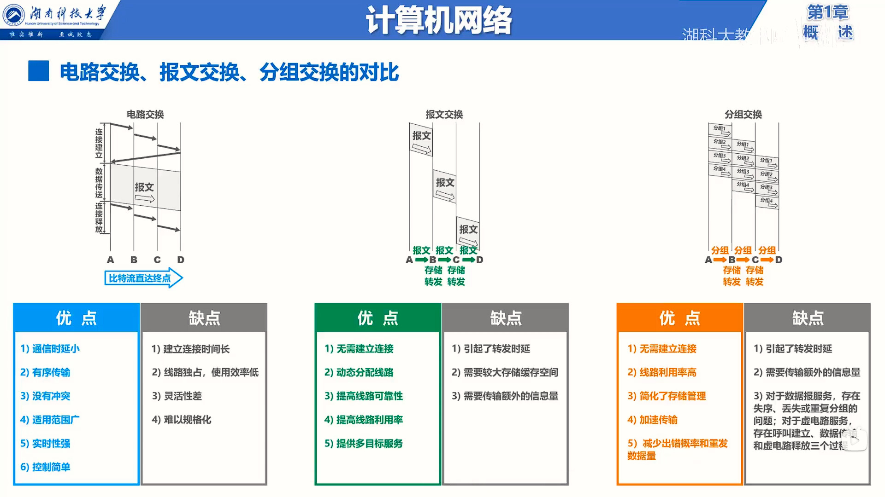

​	报文传输已经很少使用了，因为需要路由器一次缓存所有数据，现在的数据都挺大的，这种缓存的行为很不友好。

​	分组传输可以看成报文传输的分割版。

### 计算机网络体系结构

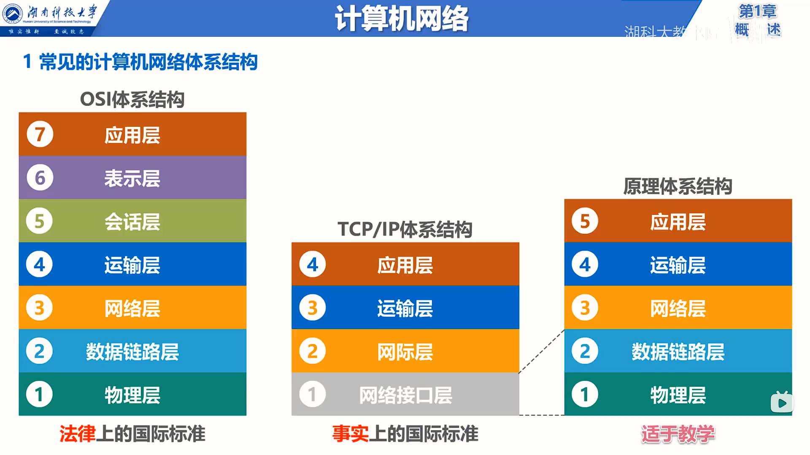

#### 解释

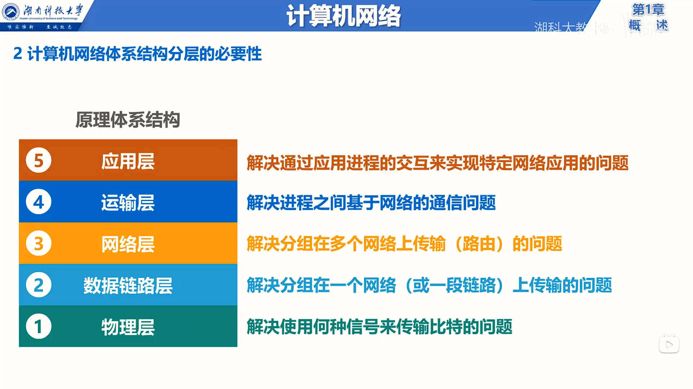

- 物理层

  ​	采用怎样的物理接口

- 数据链路层

  ​	数据在链路上将怎样传输

- 网络层

  ​	如何识别各网络中的各主机

- 运输层

  ​	解决进程之间基于网络的通信问题（即：发过来的包要给那个进程呢）

- 应用层

  ​	按照协议标准编写应用程序

#### 实例

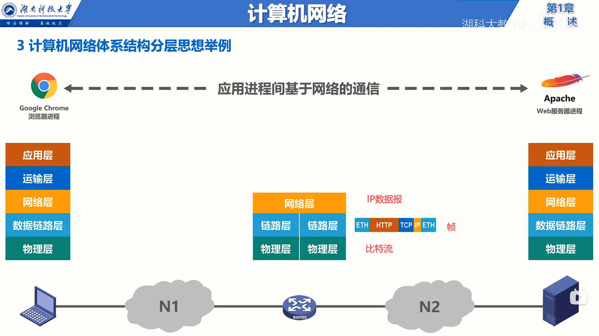

路由器没有应用程序，所以少了上面两层

#### else

***协议是水平的，服务是垂直的。***

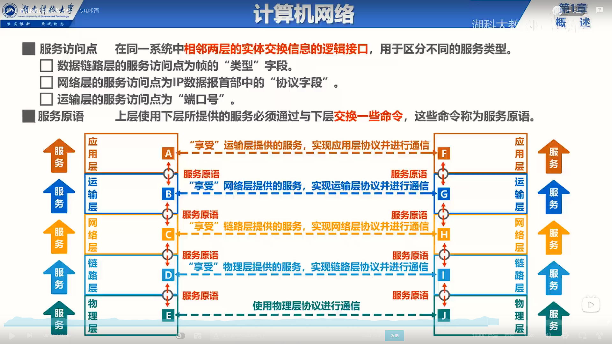

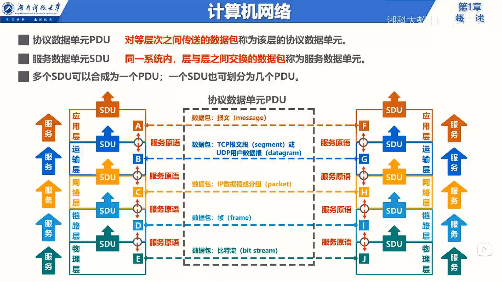

### 结合现实

- 卖家宣传的GB容量是用十进制算出来的，即 1GB = 1000MB，而不是 1GB = $2^{10}$MB，所以买回来的东西会缺斤少两

- 家里的带宽省略了末尾的比特每秒，如经常说的1000M的宽带，其实是最高速率为1000Mb/s。并不是带宽多高你就能享用多高的速率的，速率由设备里最小速率决定的。

  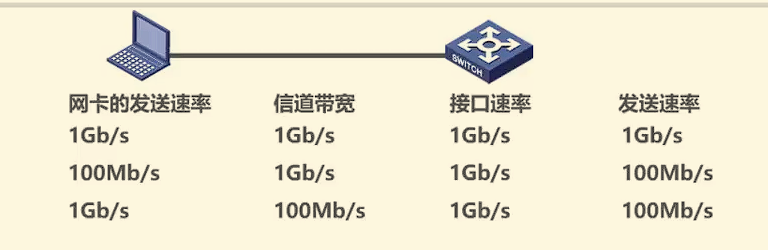

## 2. 物理层

### 物理层解决的问题

​	解决比特0和1在线路上传输的问题	

### 传输媒体

- 导引型传输媒体（就是用 ”线“ ）

  > 同轴电缆、双绞线、光纤、电力线等

- 非导引型传输媒体（最常见的使用就是WIFI了）

  > 无线电波、红外线、可见光等

### 结合现实

- 双绞线的选购

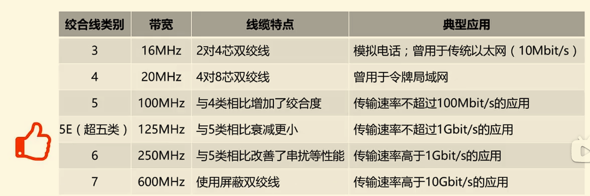

- 电台

  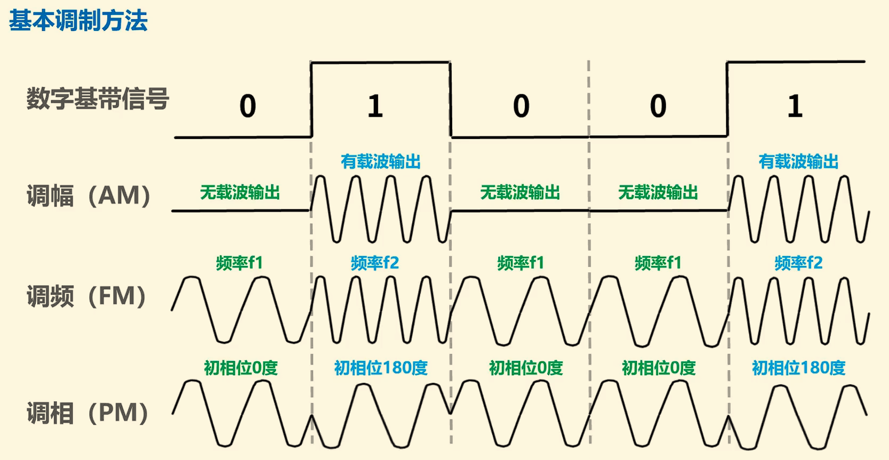

### 总结

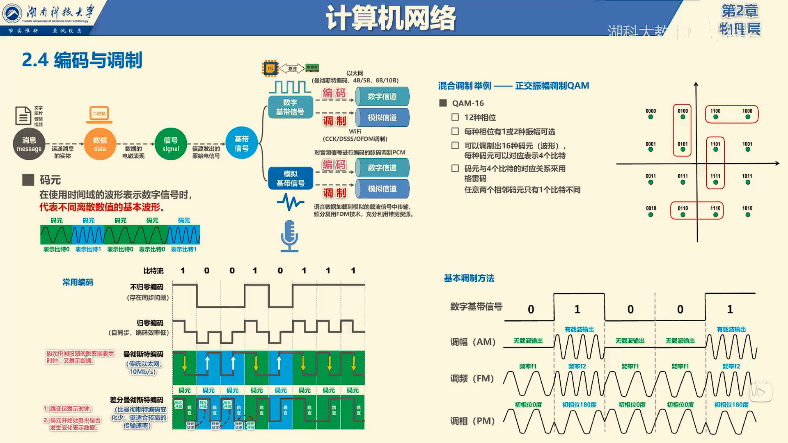

## 3.数据链路层

### 概述

​	数据链路层一帧为单位传输和处理数据

### 封装成帧

​	给上层交付的协议数据单元添加帧头和帧尾使之成为帧

数据链路层特点：透明传输（即上层可以传输任何数据，就算上层传输的数据包含帧头或帧尾，数据链路层也能通过某些方法识别出正确的 帧 ）[视频详解](https://www.bilibili.com/video/BV1c4411d7jb?p=22)

### 差错检测

- 奇偶校验
- 循环冗余校验

### ==可靠传输==

> - 运输层
>   - TCP向其上层提供面向连接的可靠传输服务
>   - UDP向其上层提供无连接、不可靠传输服务
>
> - 网际层
>   - IP向其上层提供无连接、不可靠传输服务
>
> - 网络接口层
>   - 使用PPP协议的数据链路层==向上不提供可靠传输服务==
>   - 802.11无线局域网要求数据链路层实现可靠传输
>   - 以太网不要求数据链路层实现可靠传输

#### 可靠传输的实现机制

- 停止-等待协议SW

  - 信道利用率很低

- 回退N帧协议GBN
  - 由于回退N帧协议的特性,当通信线路质量不好时,其信道利用率井不比停止-等待协议高。

- 选择重传协议SR
  - 接收窗口尺寸不应该大于发送窗口

### MAC地址

一般情况下，用户主机会包含两个网络适配器：有线局域网适配器（**有线网卡**）和无线局域网适配器（**无线网卡**)。每个网络适配器都有一个全球唯一的MAC地址。而交换机和路由器往往拥有更多的网络接口，所以会拥有更多的MAC地址。综上所述，==严格来说，MAC地址是对网络上各接口的唯一标识，而不是对网络上各设备的唯一标识==。如：电脑上的以太网接口、WiFi接口、蓝牙接口等，都各分配了一个单播MAC地址。

### IP地址

- IP地址是因特网(Internet)上的主机和路由器所使用的地址，用于标识两部分信息：
  - 网络编号：标识因特网上数以百万计的网络
  - 主机编号：标识同一网络上不同主机（或路由器各接口）

很显然MAC地址不具备区分不同网络的功能，但是IP地址可以。

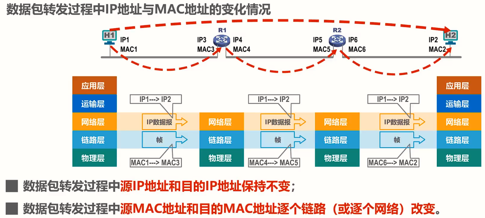

疑问：

​	设备怎么知道 下一跳的MAC地址为多少呢？即如何通过IP地址找到其对应的MAC地址？

### 地址解析协议ARP（网际层）

- 源主机在自己的ARP高速缓存表中查找目的主机的IP地址所对应的MAC地址，若找到了，则可以封装MAC帧进行发送；若找不到，则发送ARP请求(封装在广播MAC帧中)
- 目的主机收到ARP请求后，将源主机的IP地址与MAC地址记录到自己的ARP高速缓存表中，然后给源主机发送ARP响应(封装在单播MAC帧中)，ARP响应中包含有目的主机的IP地址和MAC地址
- 源主机收到ARP响应后，将目的主机的IP地址与MAC地址记录到自己的ARP高速缓存表中，然后就可以封装之前想发送的MAC帧并发送给目的主机
- *其实就是在网络里喊一声谁认识这个IP地址*

### 集线器和交换机

- 集线器==只工作在物理层==，它的每个接口仅简单地转发比特，不进行碰撞检测(由各站的网卡检测)；集线器会将单播帧传输到总线上的各个主机。
- 交换机工作在物理层和数据链路层；交换机会将单播帧转发给目的主机，而不是发给网络中的其他各个主机

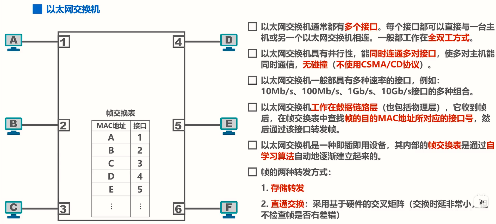

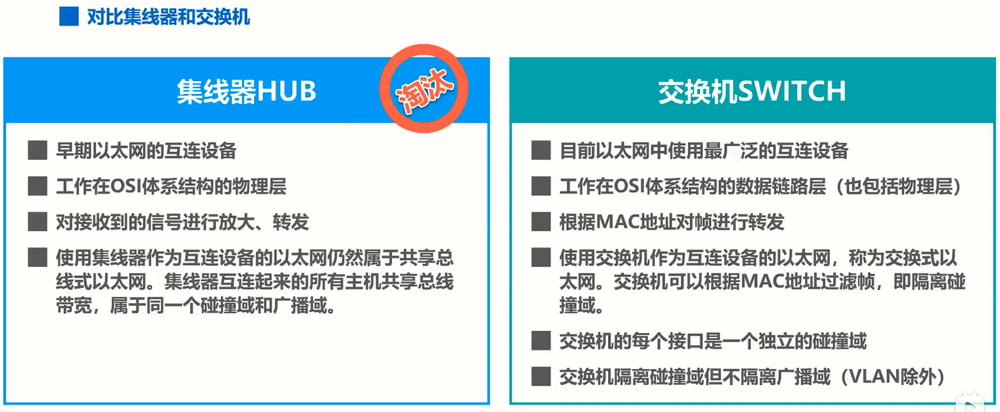

### 生成树协议STP

- 以太网交换机使用生成树协议STP(Spanning Tree Protocol)，可以在增加冗余链路来提高网络可靠性的同时又避免网络环路带来的各种问题。
  - 不论交换机之间采用怎样的物理连接，交换机都能够自动计算并构建一个逻辑上没有环路的网络，其逻辑拓扑结构必须是树型的（无逻辑环路）
  - 当首次连接交换机或网络物理拓扑发生变化时（有可能是人为改变或故障），交换机都将进行生成树的重新计算。

### 虚拟局域网VLAN

虚拟局域网VLAN（Virtual Local Area Network）是一种将局域网内的设备划分成与物理位置无关的逻辑组的技术，这些逻辑组具有某些共同的需求。

具体实现略

## 4.网络层

### 概述

- 网络层的主要任务是实现网络互连，进而实现数据包在各网络之间的传输。

### 网络层提供的两种服务

- 面向连接的虚电路服务（不流行了）
- 无连接的数据报服务（主流）

### IP

#### 分类编址的IPv4地址

- A类地址（0开头）
  - 8位网络号，24位主机号

- B类地址（10开头）
  - 16位网络号，16位主机号
- C类地址（110开头）
  - 24位网络号，8位主机号
- D类地址（1110开头）
  - 多播地址
- E类地址（1111开头）
  - 保留为今后使用

#### 划分子网的IPv4地址

​	为了解决IP地址浪费的问题而生；在分类编址的IPv4地址的基础上划分子网。

##### 子网掩码

- 32比特的子网掩码可以表明分类IP地址的主机号部分被借用了几个比特作为子网号
  - 子网掩码使用连续的比特1来对应网络号和子网号
  - 子网掩码使用连续的比特0来对应主机号
  - 将划分子网的IPv4地址与其相应的子网掩码进行逻辑与运算就可得到IPv4地址所在子网的网络地址
  
  主机号全为0 为 该网络的 **网络地址**
  
  主机号全为1 为 该网络的 **广播地址**
  
  这两个地址是不能分配出去的

#### 无分类编址的IPv4地址

- 1993年，IETF发布了无分类域间路由选择CIDR（Classless Inter-Domain Routing）

- CIDR使用“斜线记法”，或称CIDR记法。即在IPv4地址后面加上斜线“/”，在斜线后面写上网络前缀所占的比特数量。
  - 【举例】128.14.35.7 / 20

- 路由聚合（构造超网）

  - 就是找到共同前缀

  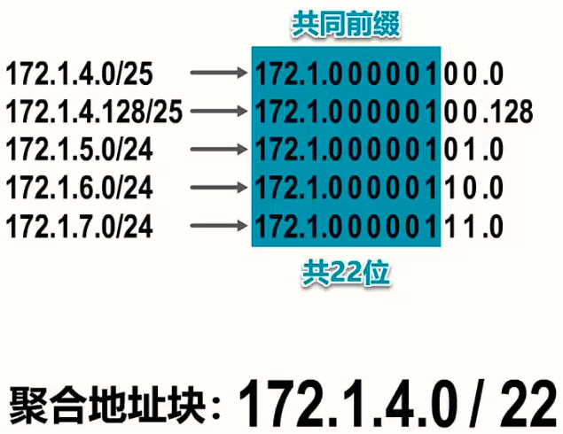

- 网络前缀越长，地址块越小，路由越具体

- 若路由器查表转发分组时发现有多条路由可选，则选择网络前缀最长的那条，这称为最长前缀匹配，因为这样的路由更具体

#### IP数据报的发送和转发

- 主机发送IP数据报
  - 为主机指定一个路由器帮忙转发IP数据报，这个路由器的地址称为：默认网关

- 路由器转发IP数据报
  - 检查IP数据报首部是否出错

    - 若出错，则直接丢弃该IP数据报并通告源主机
    - 若没有出错，则进行转发

  - 根据IP数据报的目的地址在路由表中查找匹配的条目
    - 若找到匹配的条目，则转发给条目中指示的下一跳
    - 若找不到，则丢弃该IP数据报并通告源主机

`路由器是隔离广播域的，并不会转发广播IP数据报`

>中继器和集线器工作在物理层，既不隔离冲突域也不隔离广播域。
>
>网桥和交换机(多端口网桥)工作在数据链路层，可以隔离冲突域，不能隔离广播域。
>
>路由器工作在网络层,既隔离冲突域，也隔离广播域。

#### 一些特殊的IP地址

-  地址 0.0.0.0
  - 只能作为源地址使用，表示“在本网络上的本主机”。封装有DHCP Discovery报文的IP分组的源地址使用0.0.0.0
- 地址127.0.0.1（也可以在浏览器中打成localhost）
  - 以127开头且后面三个字节非“全0”或“全1”的IP地址是一类特殊的IPv4地址，既可以作为源地址使用，也可以作为目的地址使用，用于本地软件环回测试，例如常用的环回测试地址127.0.0.1；
- 地址255.255.255.255
  - 只能作为目的地址使用，表示“只在本网络上进行广播(各路由器均不转发)”。

### 路由选择协议

- 内部网关协议
  - 路由信息协议RIP
  - 开放最短路径优先协议SOPF
- 外部网关协议
  - 边界网关协议BGP
  - BGP只能是力求寻找一条能够到达目的网络且比较好的路由（不能兜圈子），而并非要寻找一条最佳路由

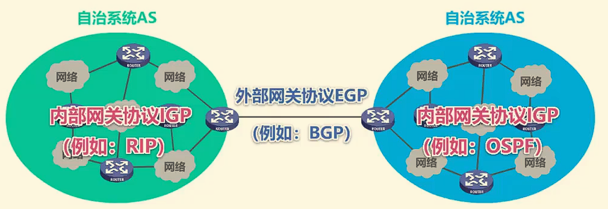

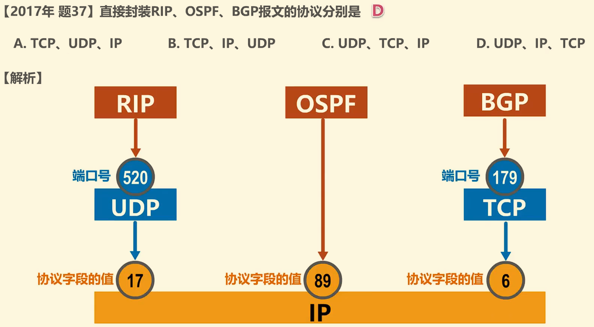

### ICMP

> 全称：网际控制报文协议

#### 五种ICMP差错报告报文

  - 终点不可达：当路由器或主机不能交付数据报时，就向源点发送终点不可达报文。具体可再根据ICMP的代码字段细分为目的网络不可达、目的主机不可达、目的协议不可达、目的端口不可达、目的网络未知、目的主机未知等13种错误。
  - 源点抑制：当路由器或主机由于拥塞而丢弃数据报时，就向源点发送源点抑制报文，使源点知道应当把数据报的发送速率放慢。
  - 时间超过：
    - 当路由器收到一个目的IP地址不是自己的IP数据报，会将其生存时间TTL字段的值减1。
    - 若结果不为0，则将该IP数据报转发出去；若结果为0，除丢弃该IP数据报外，还要向源点发送时间超过报文。
    - 另外，当终点在预先规定的时间内不能收到一个数据报的全部数据报片时，就把已收到的数据报片都丢弃，也会向源点发送时间超过报文。
  - 参数问题：当路由器或目的主机收到IP数据报后，根据其首部中的检验和字段发现首部在传输过程中出现了误码，就丢弃该数据报，并向源点发送参数问题报文。
  - 改变路由（重定向）：路由器把改变路由报文发送给主机，让主机知道下次应将数据报发送给另外的路由器（可通过更好的路由）。

#### 两种常用的ICMP询问报文

  - 回送请求和回答
  - 时间戳请求和回答

#### ICMP应用举例

- 分组网间探测（ping命令）
- 跟踪路由（在windows中是tracert命令）

### VPN和NAT

​	虚拟专用网VPN：利用公用的因特网作为本机构各专用网之间的通信载体，这样的专用网又称为虚拟专用网。

​	网络地址转换NAT：NAT能使大量使用内部专用地址的专用网络用户共享少量外部全球地址来访问因特网上的主机和资源。

## 5.运输层

### 概述

- 运输层直接为应用进程间的逻辑通信提供服务

### 运输层端口号

- 端口号：TCP/IP体系的运输层使用端口号来区分应用层的不同应用进程。（取值范围：0~65535）
  - 熟知端口号:0~1023，IANA把这些端口号指派给了TCP/IP体系中最重要的一些应用协议，例如：FTP使用21/20，HTTP使用80，DNS使用53。
  - 登记端口号：1024~49151，为没有熟知端口号的应用程序使用。使用这类端口号必须在IANA按照规定的手续登记，以防止重复。例如：mysql默认端口号：3306（这是可以改的）。
  - 短暂端口号：49152~65535，留给客户进程选择暂时使用。当服务器进程收到客户进程的报文时，就知道了客户进程所使用的动态端口号。通信结束后，这个端口号可供其他客户进程以后使用。

==端口号只具有本地意义，即端口号只是为了标识本计算机应用层中的各进程，在因特网中，不同计算机中的相同端口号是没有联系的。==

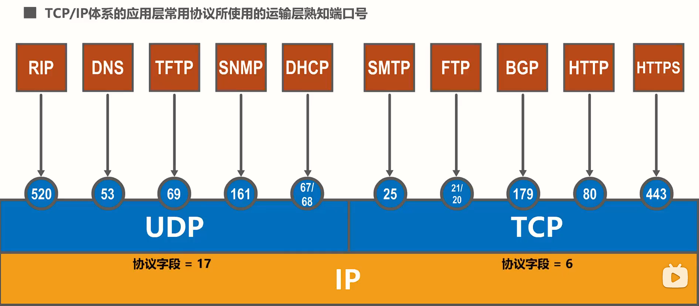

