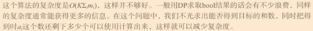

# 读书笔记：挑战程序设计竞赛（第二版）

## 0.前言

学校里有个老师天天上课阴阳怪气，还老讲他前女友的故事，还不让玩手机。无奈找了一本书看看，就是这本了。

## 1.准备篇

### POJ1852

我最早在大一的时候看到了这道题目，我还去问了当时的C语言老师怎么写，当然了，没有回复我答案。回到题目上来，这道题目想通了就很简单咯。


掉头 和 灵魂穿越般的过去是一样，那么这两种状态就一样嘛，显然后者状态好计算多了。感叹一句，这题真的经典。

### 优化抽签问题

原本是（$n^4$）   通过二分搜索优化最内层循环（d = m - a - b - c）   变成 （$n^3logn$）

​    再优化内侧的两个循环，这两个循环在检查是否有（c + d = m - a - b）

​	所以先枚举c + d 的（$n^2$）个结果，再排序，再二分搜索。注意啊，排序的时间复杂度原本是：$n^2log(n^2)=n^2*(2logn)=2n^2logn$，这个两倍完全太小了可以省略

​	最终就优化成：$n^2logn$

这不比背面经有趣？

## 2.初级篇

### 2.1穷搜

P35使用数组来存储四个方向，这种表示挺有趣的，其他的没啥好说的。


### 2.2贪心

#### 2.2.1

P40，区间问题

- 选最先结束的工作，这个思路太棒了

#### POJ3617

P44的思路没有说清楚，是有点问题的，他说如果相同，取哪个都可以


请看他给的样例 ACDBCB，当两个C进行选择时，是要选择后一个C的，因为后一个C的前一个字母是B。所以，相同时，要继续移进比较，选出小的那个（如果没有就随意了），再回来选择。

有趣的是：他给的代码确实是正确的思路，应验了那句话：Talk is cheap. Show me the code.

仔细看，他代码中的唯一一个for循环，里面并没有写相等的情况，这个for很巧妙哦

#### POJ3069

思路很简单，不过一般人可能写不出来他这么清爽的代码

#### POJ3253

我最开始想的是，先从大到小的顺序，再依次每次割除最大的那个，如下图所示：


题目只有三块板子，但凡多一点，这个思路就显示出问题了。

真没有想到啊，思路居然是二叉树。模板长度 * 节点深度 = 所求值 。amazing啊！

- 来理清思路
  - 找到最短板和次最短板，合成一个新板，将这个新板的长度加入ans中，将最短板和次最短板删掉。
  - 重复上述操作直到只有一块板子。
- 来看看他的代码
  - 前面代码都正常，注意看这几行

```c
if (mii1 == N - 1) swap(mii1, mii2);
L[mii1] = t;
L[mii2] = L[N - 1];
```

按照之前的思路，我们需要将合并的新板加进来，去掉两个板子。为了好写，我们使用了N--来控制板子的数量，这造成了一个问题，N - 1号板子会莫名消失，所以需要加进来，这里又出现了一个问题，如果N - 1号板子就是 最短板或次最短板 呢？那不是不用加进来了嘛，那咋办吗，写几个if进行嵌套判断？他给了个方法：合并后的板子替换掉mii1号板子，N - 1号板子替换掉mii2号板子（此时依旧没有解决  **N - 1号板子就是 最短板或次最短板**  的情况），再次之前进行一次判断，如果  N - 1号板子就是最短板，那就交换 mii1与mii2的值。完了？就这？注意理解哦，你要保证第二行L[mii1] = t 赋值成功，但是不需要保证第三行L[mii2] = L[N - 1]赋值成功，如果mii2号板子就是N-1号板子，那不是很好嘛，正好舍弃掉。但是啊，N-1号板子也可能是mii1号板子呀，所以就需要交换mii1与mii2的值咯。

- 精准而优雅

### ==2.3动态规划==

***“状态这个概念在这里得到了很好的体现”***

#### 背包问题

​	看他演变过程

- 先是最容易想到的暴力搜索：一个物品有选和不选两种状态，然后进行枚举搜索，时间复杂度为$2^n$，显然这是一个很糟糕的选择
- 改进：找个数组将之前算出来的结果存起来，要用的时候直接读取就行了。注意：P52有个二叉树的图片，仔细看，每一层都只由下一层推出来，即：（4，0-5）推出（3，0-5），而（2，0-5）与（4，0-5）就没有啥关系了。所以，在计算（2，0-5）时，就没有必要存（4，0-5）了。这为后面dp数组从二维变成一维提供依据。
- 再改进：上一个步骤中是使用递归进行搜索的，但是可以用简单的二维数组完成此项搜索。为什么两个for循环可以完成，之前的递归搜索呢？还是上个步骤中说的：每一层都只由下一层推出来。这样，基础的dp模板就出现了

```c
int dp
void solve(){
    //记得初始化
    for(...){
        for(...)
            //递推式
    }
}
//根据递推式的不同写法，甚至会出现for循环中的变量从高到低变化（n..0）
```

- 其中最重要的是：写一个正确并且简洁的递推式

#### 最长公共子序列问题（LCS）

- 既然是==公共==的子序列，那么咱们就考虑 s[i]==s[j] 和 s[i]!=s[j] 的情况。
  - 如果相等，dp [i] [j] = dp [i-1] [j-1] + 1  (我就不懂为啥要与dp [i] [j-1]、dp [i-1] [j]扯上关系，书上是用dp [i+1] [j+1]开始推导，我是用dp [i] [j]，这都无所谓的)
  - 如果不等，那就取dp [i-1] [j] 和 dp [i] [j-1] 中的最大值了

#### 完全背包问题

​	解释一下P59首行所说的重复部分

- 看P58最下方的图片。当你计算dp [3] [3] 时，你将会有两次k值的计算，即k = 0 、1，所以你得计算dp[2] [3]                和dp [2] [1]的值然后得出dp [3] [3]的最终值；当你计算dp [3] [5]，有三次k值的计算，即k = 0 、1、2，所以你得计算dp[2] [5] 和 dp [2] [3] 和 dp [2] [1] 的值然后得出dp [3] [5]的最终值。发现了吗，dp [2] [3]已经计算过了，而dp [2] [5]又计算了一遍，所以这些就是重复部分，就是图上画箭头的部分了。

- 然后就是将二维数组变成一维。既然dp [i + 1] [j] 的递推式里就只有dp [i] [j] 和 dp [i + 1] [j - w[i] ]，那就无需存dp [i + 1] 之前的数据了。
- P60中间的代码乍一看很厉害，后来想了想好像也没有那么厉害，还没有直接写成一维的数组简介。

==如无必要，勿增实体==

#### 完全背包变式

- 写了这么久的代码。发现了没有，一个二维数组有三个变量可以传递信息，dp [ i ] [ j ] ，i 可以可以代表一个信息，j 可以代表一个信息，dp [ i ] [ j ] 的值可以代表一个信息。

- 原来dp [] [] 三个信息  dp值、一维i、二维j  代表着  v 、n 、w ，变成了代表 w 、n 、v 了。给dp的值赋予规则，让其携带更多信息（dp值为INF时，代表着不存在的情况）。
- 虽然，没有在dp[] []数组的确定位置的算出答案，但是知道答案就在dp数组中，最后遍历数组即可知道答案，这种对获取答案的妥协，却可以简便获取dp数组的过程。

#### 多重部分和问题

P63说：



这就是信息存储的选择了。

这题  dp的值  所代表的信息挺有趣的，代表着  用前i种数加和得到j时第i种数最多能剩余多少个(不能加和得到j的情况下为-1) 。这种常人难以想到的信息代表，后面经常出现。

注意这个递推式的中间项是小于等于0


#### 最长上升子序列

第一种$n^2$解法还是很好看懂的，第二种$nlogn$解法就难了亿点

- 第二种对比于第一种，在dp数组的值上进行了革命性改动（其实和完全背包变式的套路一样）使得dp数组成为了一个有序数组，为二分搜索做准备。附上[力扣链接](https://leetcode-cn.com/problems/longest-increasing-subsequence/solution/zui-chang-shang-sheng-zi-xu-lie-by-leetcode-soluti/)，讲的清楚一些。
- 他在代码里用了个STL函数 lower_bound，这个函数是左闭右开的，用的是二分搜索，返回的是第一个大于k的***指针***，这就是为什么for循环里加*号后可以直接赋值的原因。但是，我木有看懂最后输出的时候可以剪dp，本人c++菜鸡，望大神指点。

#### 划分数

为什么这一章看得这么慢就是因为有这种题目的存在，完全看不懂递推式啊。（就是自己菜）

- 这题目啊，应该这么理解：n个无区别物品放进m个盘子，允许存在空盘子，问有多少种放法。[类似题目](https://www.nowcoder.com/practice/4f0c1e21010e4d849bde5297148e81d9?tab=answerKey)

- 样例就代表着：1+1+2=1+3+0=2+2+0=4+0+0

- 这就好解释递推式了

  - 物品数 j 小于盘子数 i 时，必定有空盘子嘛，dp [ i ] [ j ] 就等于 dp [ j ] [ j ] 

  - 物品数 j 大于等于盘子数 i 时，可以出现没有空盘子，也可以出现空盘子

    - 没有空盘子时，dp [ i ] [ j ] 相当于在dp [ i ] [ j - i ] 的摆法上全部加一个盘子，

      即   dp [ i ] [ j ] =dp [ i ] [ j - i ] 

    - 有空盘子时，dp [ i ] [ j ] 拿出一个盘子做空，其余继续摆就行了，可能你要问，拿俩个盘子做空不行吗？拿俩个盘子做空就是dp [ i - 2 ] [ j ] 的值，但是这个dp [ i - 1 ] [ j ]中就包含了这个值呀，你就重复计算了

      所以此时dp [ i ] [ j ] = dp [ i - 1 ] [ j ] 

    - 最终 dp [ i ] [ j ] = （dp [ i ] [ j - i ] + dp [ i - 1 ] [ j ] ）% M

#### 多重集组合数

​	**加油**

